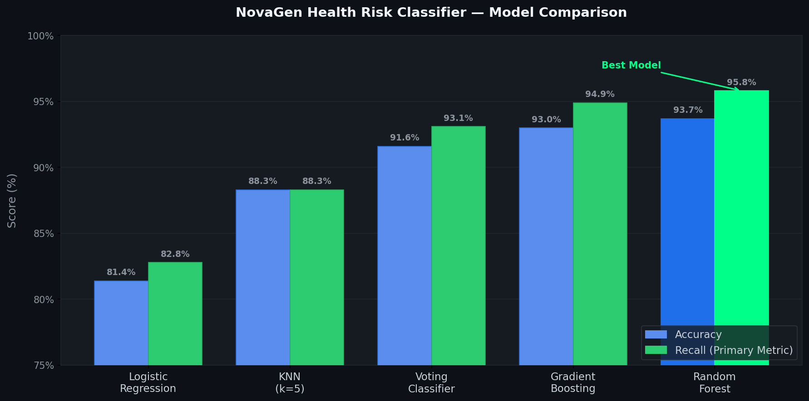

# 🧬 NovaGen Health Risk Classifier

> **Supervised Machine Learning | Ensemble Methods | Binary Classification**

A machine learning project for **NovaGen Research Labs** — a leading biomedical research institute. The goal is to classify individuals as **Healthy** or **At Higher Health Risk** using ensemble ML models trained on 9,800 health records.

---

## 📋 Table of Contents
- [Problem Statement](#problem-statement)
- [Dataset](#dataset)
- [Models & Results](#models--results)
- [Project Structure](#project-structure)
- [How to Run](#how-to-run)
- [Key Insights](#key-insights)
- [Tech Stack](#tech-stack)

---

## 🎯 Problem Statement

NovaGen annually recruits thousands of volunteers for population health studies. The institute needed a reliable model to distinguish between **healthy participants** and those **at higher health risk** — supporting:

- Clinical trial participant selection
- Risk-based population stratification
- Long-term health outcome analysis

---

## 📊 Dataset

| Property | Detail |
|----------|--------|
| Total Records | 9,800 unique participants |
| Features | 22 (physiological, lifestyle, medical history) |
| Target | Binary — `0: Healthy`, `1: At Risk` |
| Split | 80% train / 20% test (stratified) |

**Key Features:**

| Feature | Description |
|---------|-------------|
| `BMI` | Body Mass Index |
| `Blood_Pressure` | Systolic BP (mmHg) |
| `Cholesterol` | Cholesterol level (mg/dL) |
| `Glucose_Level` | Blood glucose (mg/dL) |
| `Stress_Level` | Scale 1–10 |
| `Smoking` | 1 = Smoker, 0 = Non-smoker |
| `MedicalHistory` | Prior conditions |
| `Sleep_Hours` | Avg hours/day |
| `Exercise_Hours` | Avg hours/day |

---

## 🤖 Models & Results

> **Primary metric: Recall** — Missing a high-risk patient is clinically dangerous, so we minimize False Negatives.

| Rank | Model | Recall | Accuracy |
|------|-------|--------|----------|
| 🥇 1 | **Random Forest** | **95.8%** | **93.7%** |
| 🥈 2 | Gradient Boosting | 94.9% | 93.0% |
| 🥉 3 | Voting Classifier | 93.1% | 91.6% |
| 4 | KNN (k=5) | 88.3% | 88.3% |
| 5 | Logistic Regression | 82.8% | 81.4% |



### ✅ Best Model: Random Forest
Random Forest achieved the highest Recall of **95.8%** — correctly identifying 95.8% of all at-risk individuals. Ensemble bagging with 200 trees reduced variance significantly compared to single models.

---

## 📁 Project Structure

```
novagen-health-classifier/
│
├── 📓 notebooks/
│   ├── 01_novagen_main_project.ipynb      ← Main project (all 5 models + results)
│   ├── 02_adaboost.ipynb                  ← AdaBoost concept & implementation
│   ├── 03_gradient_boosting.ipynb         ← Gradient Boosting (regressor + classifier)
│   ├── 04_ensemble_heterogeneous.ipynb    ← Voting & Stacking (classifier + regressor)
│   └── 05_xgboost_classification.ipynb   ← XGBoost classifier
│
├── 📂 data/
│   └── novagen_dataset.csv                ← Dataset (9,800 records, 23 columns)
│
├── 📂 docs/
│   └── model_comparison.png               ← Auto-generated comparison chart
│
├── 📂 assignment/
│   └── Supervised_ML__Assignment5.pdf     ← Original problem statement
│
├── requirements.txt
├── .gitignore
└── README.md
```

---

## 🚀 How to Run

### 1. Clone the repository
```bash
git clone https://github.com/Nandd11/novagen-health-classifier.git
cd novagen-health-classifier
```

### 2. Install dependencies
```bash
pip install -r requirements.txt
```

### 3. Launch Jupyter
```bash
jupyter notebook
```

### 4. Open notebooks in order
Start with `notebooks/01_novagen_main_project.ipynb` for the complete project.

---

## 💡 Key Insights

- **Ensemble > Single models**: Recall jumped from 82.8% (Logistic Regression) to 95.8% (Random Forest) — a **+13% improvement**
- **Bagging vs Boosting**: Random Forest (bagging) slightly outperformed Gradient Boosting on this dataset
- **Feature Importance**: Physiological indicators (BMI, Blood Pressure, Glucose) were the strongest predictors
- **Soft Voting**: Averaging probabilities outperforms hard majority voting for medical classification

---

## 🛠️ Tech Stack


---

## 📄 License

This project is for academic purposes — Supervised ML Assignment 5.
